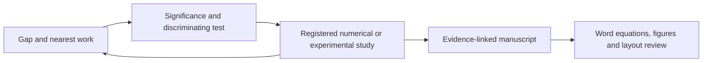

# Research Mechanics Skills

[中文介绍与完整教程](README.zh-CN.md) · [Installation](docs/INSTALL.md) · [Codex validation](docs/CODEX_VALIDATION.md) · [Measured checks](docs/VALIDATION_REPORT.md) · [Sources](docs/SOURCES.md)

Five installable Codex skills for mechanics, buckling metamaterials and robotics research. They turn contribution framing, literature gaps, manuscript revision and numerical checks into evidence-linked workflows with runnable local helpers.

| Skill | What it produces | Runnable resources |
|---|---|---|
| [`research-significance`](skills/research-significance/SKILL.md) | Decision → mechanism → evidence → falsifier | Significance contract auditor and JSON example |
| [`research-gap`](skills/research-gap/SKILL.md) | Bounded gap candidates and closest-work matrix | Search ledger auditor, DOI deduplication, CSV/JSON templates |
| [`research-writing`](skills/research-writing/SKILL.md) | Clear scientific argument with preserved Main/SI evidence | Claim/figure preservation and SHA-256 provenance auditor |
| [`research-word`](skills/research-word/SKILL.md) | Scientific Word reports with explicit derivations, section-specific figures and interpretation | Section map, Word workflow and standard-library DOCX package inspector |
| [`fem-explicit-bifurcation`](skills/fem-explicit-bifurcation/SKILL.md) | Registered model, Explicit evidence and scoped stability interpretation | Named BC selection, INP generation, ODB extraction, energy/event checks, fold/pitchfork oracle |

## Install and try

Python 3.10+ is sufficient for the portable audit tools; they use only the standard library. Creating and rendering Word documents uses an available document authoring runtime or installed Word/LibreOffice; see [Research Word](docs/RESEARCH_WORD.md). Abaqus execution is optional and requires an existing licensed installation.

```bash
git clone https://github.com/DJDeborah/research-mechanics-skills.git
cd research-mechanics-skills
python tools/install.py --user
python -m unittest discover -s tests -v
python tools/run_demo.py --out local-runs/demo
```

Open a new Codex task/turn, then invoke one of the skills:

```text
Use $research-gap to inspect this research idea and the supplied papers.
Build a capability matrix, search for counterexamples, and give a bounded gap.
```

For project installation, use `python tools/install.py --project ../my-research-project`. The installer copies complete skill directories into `.agents/skills` and refuses overwrites. A built-in `$skill-installer` route is also documented in [INSTALL](docs/INSTALL.md).

## A workflow that keeps evidence connected



Every skill is self-contained and can be used independently. The shared workflow is useful when a promising mechanism must survive a counterexample, a failed numerical prediction and a manuscript revision.

The reusable research habits are physical problem registration, explicit calibration/holdout separation, distinction between observable events and stability, and preservation of the claim–figure–data–code chain. Only generalized habits and synthetic teaching fixtures are included; there are no private manuscripts or specimen results in this repository.

## What has been checked

The local portable suite has 41 tests, including wrong boundary selection, leakage, missing source passages, dropped core figures, altered evidence files and excessive inertia. Five metadata entrypoints were checked with the bundled skill validator. A real Abaqus/Explicit R2019x elastic beam was solved and its ODB read; see [the measured report](docs/VALIDATION_REPORT.md) for values and scope.

The beam adapter supports a straight elastic planar B21 cantilever. Named selections and output auditing are reusable; another geometry, contact model or material requires its own adapter. The analytic fold/pitchfork examples are known normal-form oracles, not a general FE continuation solver. Automated audits cannot certify significance, novelty or scientific truth.

The repository includes an Agent Plugins `plugin.json` manifest. This GitHub release is a skill package; it has not been submitted to the public OpenAI plugin directory.

## Package layout

```text
skills/<skill-name>/
  SKILL.md              activation and workflow
  agents/openai.yaml    Codex display metadata
  scripts/              executable helpers
  assets/               working templates
  references/           domain contracts and adaptation notes
tools/                  installer and end-to-end runners
tests/                  positive and negative controls
examples/               generated portable demonstration
validation/             measured, sanitized solver summaries
docs/                   tutorials, validation and source attribution
plugin.json             portable bundle manifest
```

Read [SOURCES](docs/SOURCES.md) for the commit-pinned open-source influences and the distinction between inspected guidance and actually tested execution. New helper code is MIT licensed. Contributions should include an informative example, a failure case and an honest statement of scope.
